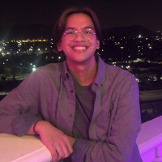

## UCR CSE Undergraduate Learning Assistants

### Are you an undergrad who wants help in one of these CSE courses?

- Software: CS 10A, 10B, 10C  (formerly known as CS 10, 12, 14)
- Algorithms: CS 111, 141 
- Computer systems: CS 61 

Your friendly neighborhood ULAs are ready to help! Just drop in to one of their help desk hours listed in the Calendar below with any questions you have. **It's free, and no advance registration required.** Some sessions are held online through Zoom, and others outside [Bytes cafe](https://campusmap.ucr.edu/?find=Bytes) (the cafe on the ground level of Winston Chung Hall).

### CS 10A, 10B, 10C Calendar

<iframe src="https://calendar.google.com/calendar/embed?height=600&wkst=1&bgcolor=%23ffffff&ctz=America%2FLos_Angeles&showTitle=0&showPrint=0&mode=WEEK&showTabs=0&showCalendars=0&src=Y18zanV1dGhmanBjZmZiazJ0dWExcGo4MHNmOEBncm91cC5jYWxlbmRhci5nb29nbGUuY29t&color=%23D81B60" style="border:solid 1px #777" width="800" height="600" frameborder="0" scrolling="no"></iframe>

&nbsp;

### CS 111, 141 Calendar

<iframe src="https://calendar.google.com/calendar/embed?height=600&wkst=1&bgcolor=%23ffffff&ctz=America%2FLos_Angeles&showTitle=0&showPrint=0&mode=WEEK&showTabs=0&showCalendars=0&src=Y19pdHVkMDNzY2s3cmduZnY2NnA5cHNrbGNuZ0Bncm91cC5jYWxlbmRhci5nb29nbGUuY29t&color=%233F51B5" style="border:solid 1px #777" width="800" height="600" frameborder="0" scrolling="no"></iframe>

&nbps;

### CS 61 Calendar

<iframe src="https://calendar.google.com/calendar/embed?height=600&wkst=1&bgcolor=%23ffffff&ctz=America%2FLos_Angeles&showTitle=0&showPrint=0&mode=WEEK&showTabs=0&showCalendars=0&src=Y19lb20wZWE4dm1pZzJwdGtmcDBqdWEwOXA1a0Bncm91cC5jYWxlbmRhci5nb29nbGUuY29t&color=%23F4511E" style="border:solid 1px #777" width="800" height="600" frameborder="0" scrolling="no"></iframe>

&nbsp;

### Program Overview

The UCR CS ULA program is launching in Fall 2021. The goals of the program are to:
- improve the learning experience of students in core CS courses
- build a sense of community amongst undergraduate students
- create a supportive environment for underrepresented groups in CS

Towards this, students will be hired and trained as undergraduate learning assistants (ULAs) to act as peer tutors for selected CSE classes.
ULAs will provide open "help desk" hours at a specific location (TBD) in Winston Chung Hall, and assist students with course content, homeworks, labs, etc.

The UCR CS ULA program is managed by Prof. Jiasi Chen with help from Profs. Paea LePendu, Mariam Salloum, Tamar Shinar, and Yihan Sun.

### Updates

- **Sept. 30, 2021:** ULA schedules are posted above, starting Oct. 4! ULA hours will be held outside Bytes cafe, or online through Zoom. Software is in purple, algorithms is in blue, and computer systems is in orange.
- **Sept. 21, 2021:** ULA help desk sessions will start in week 2 of Fall'21. Keep checking the calendar below for updates on when ULAs will be staffing the help desk.
- **Aug. 5, 2021:** We are currently reviewing applications and expect to send interview invitations within the next few days. Thanks for your patience, and stay cool!

### Fall'21 ULAs

| Picture            | Name |
| ----------- | ----------- |
|             | **Aaron**: Hi! I'm Aaron Geesink, a senior in computer science at UCR. I'm graduating in the class of 2022 but plan on getting my masters degree in 2023. Even though I'm a senior, this year is my first year physically on campus, which will certainly be lots of fun! I decided to be a ULA because I find myself helping other students in my classes all the time. I seem to have figured out this whole college thing by now, so I want to use my knowledge to pay it forward to anyone willing to lend an ear. My random fact is that I'm a fanatic for japanese arcade games! I love to go Round1 after class and play Dance Dance Revolution and Beatmania all night!        |
|       |  **Brij**: Hi! My name's Brij and I’m a Junior studying Computer Science. I wanted to be a ULA, because I really like to teach and see the “spark” in people’s eyes when they finally understand something. I also have some prior tutoring experience, and really enjoyed it, so wanted to give it another shot in college. A random fact about me is that I can solve a Rubiks cube in under a minute.       |
|             | **Cody**: I am Cody Kurpanek, a second year computer science major. I am excited to be a ULA because learning to solve problems individually is my passion, so in my freshman year, I loved explaining my strategies to learn and succeed in any class while helping my friends with specific classes. A fun fact about me is that I am learning Hindi!       |
|             | **Diane**: I am a third year computer science major and I wanted to be a ULA because helping people is lots of fun and I was in the same boat before as well! A random fact about me is that my hearing is not very good so one of the words I most often say is "huh".       |
|             | **Edgarventura**: My name is Edgarventura Melendrez, but I usually only go by Edgar. I'm a second year Computers Science major who upon finding himself lost trying to navigate college life, found himself being helped by all kinds of people such as professors, counselors, and even other students. Which is why I really wanted to become a ULA, because I wanted nothing more than to return a little bit of the kindness I received back into the UCR community. A little fun fact about myself is that over the pandemic I began teaching myself how to play the harmonica, and so far I've been enjoying it quite a lot!        |
|             | **Gabriel**: Hi everyone, I'm Gabriel Rueals, a junior at UCR. I'm a CS major, and I wanted to become a tutor because I'm interested in being a professor myself one day and this seemed like a good place to start. I'm into a wide genre of video games and love pizza.        |
|             | **Joshua**: Hi! My name is Joshua Candelaria and I'm a sophomore computer science major. I wanted to be a ULA because I enjoy teaching and helping others, and I have a passion for what we're learning in these classes. A random fact about me is that I am a huge basketball nerd.         |
|              | **Taneesha**: I am a Computer Science Major. This is my second year at UCR, so I am a sophomore. I decided to join the ULA because I understand the feeling of being lost and hesitating to reach out for help, and all we need is reassurance and a little help to discover our potential. I love helping people with the resources that I have. A random fact about me is that I love eating spicy food and challenging myself to eat the spiciest that I can get. I am also a huge fan of the boyband BTS! |
|             | **Yuta**: My major is Computer Science, and I'm a first year Master's student. I joined the ULA program because I really like helping people and seeing them succeed! I look forward to seeing you all! A random fact is I used to do a lot of Japanese Archery, and I was also selected as part of Team USA for the third world cup!       |

<!--
### We're Hiring!

We are currently hiring ULAs for the following topic areas:

- Software: CS 10A, 10B, 10C (formerly known as CS 10, 12, 14)
- Algorithms: CS 111, 141
- Embedded systems: CS 61

Strong applicants will be those who have done well in their classes, have good interpersonal skills, and are enthusiastic about tutoring/mentoring. Preference will be given to those who have taken the classes at UCR.

### ULA Responsibilities

ULAs will have shifts in the help desk room (TBD in Winston Chung Hall), and tutor any drop-in students with questions about the course. ULAs will work for approximately 10 hours/week, broken up into 2-3 shifts (exact schedule TBD based on the ULAs' individual availability). The pay rate for ULAs is expected to be around $16-17/h, commensurate with other tutoring programs on campus.

If selected, ULAs must enroll in CS190: Apprentice Teaching for Undergraduates in Fall'21. This will be a weekly 1-hour seminar on computer science education worth 2 credits, taken S/NC, and will discuss current best practices for CS education. It will be led by Prof. Chen and modeled on similar courses (e.g., at [UCSB](https://ucsb-teaching-cs.github.io/w21/)).

### Application Process

1. Applications are now closed! **Deadline: Friday July 16, 2021**. The application form requests basic biographical information, a copy of your transcript, and several short-answer questions.
2. Selected applicants will be contacted for a brief (30-minute) video interview, about 1 week after the application closes. The applicant will be requested to prepare a 5-minute teaching demo on a topic given in advance.

-->

### Contact

Questions? Concerns? Contact Prof. Chen via email at "jiasi at cs dot ucr dot edu".
